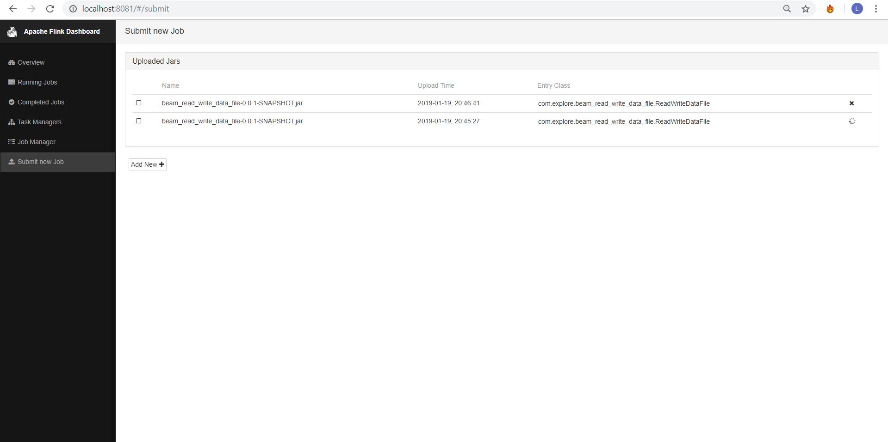
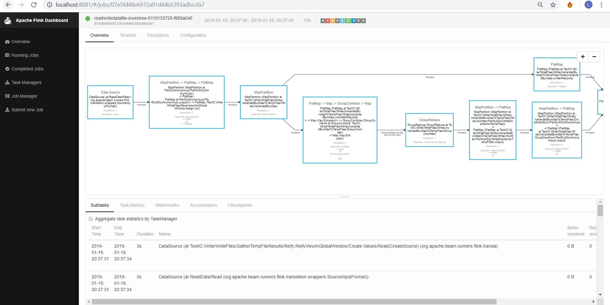

# Read and Write Data from/to HDFS File 

# Prerequisites:
1. Java 8
2. Apache Beam 2.9.0
3. Apache Flink 1.5.5
4. Apache Hadoop 2.8.3

## Examples
### Example of Submitting a new Job

### Example of Completed Job which is shown on Apache Flink Dashboard

